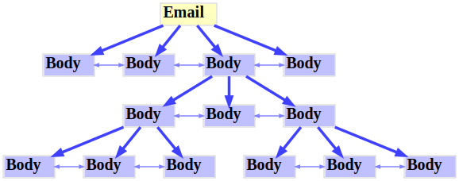

# Refactoring `struct Body`

## Current Scheme

**Key**:
- Green: `Body->next`
- Red: `Body->parts`

The `Body`s are singly-linked.

## Proposed Scheme

This scheme uses `TAILQ` to group the children.
The `Body`s are doubly-linked.

