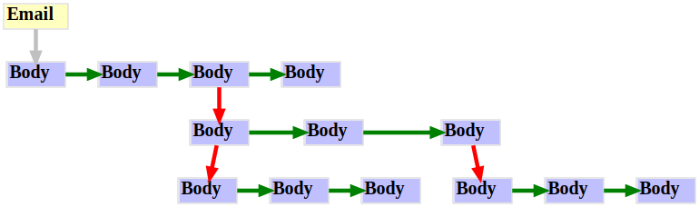

# Refactoring `struct Body`

## Current Scheme

**Key**:
- Green: `Body->next`
- Red: `Body->parts`



The `Body`s are singly-linked.

## Proposed Scheme

This scheme uses `TAILQ` to group the children.
The `Body`s are doubly-linked.


## Sample Code

The sample code mimics an email with lots of nested attachments.
The code recursively dumps the structures.

To compile: (with ASAN)

```sh
gcc -Wall -Wextra -Wpedantic -I. -fsanitize=address -o email *.c
```

To run:
```sh
./email
```
